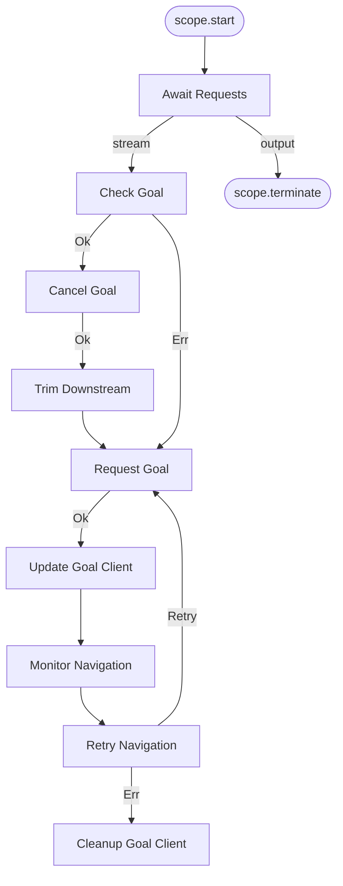
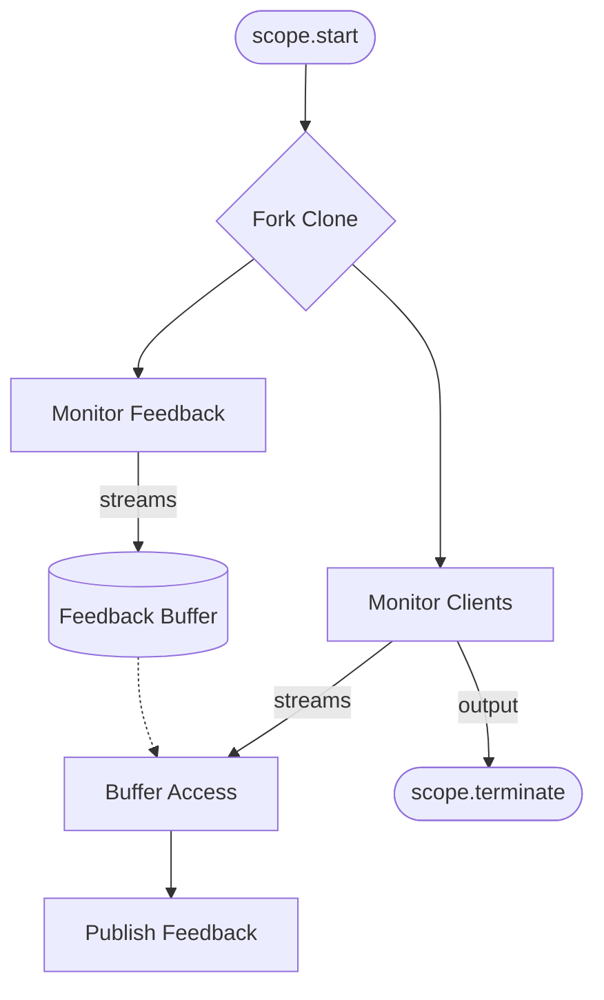

# next_gen_nav2_traffic


# InnerNavigationServices Workflow Diagram

This document describes the workflow in `InnerNavigationServices`, specifically the `await_and_send_goal` workflow, implemented using Crossflow.

## Workflow Diagram



## Node Descriptions

- **`await_new_requests`**: A continuous service that listens for `InnerNavigationTarget` events and streams `InnerNavigationRequest` objects.
- **`check_existing_goal`**: Checks if the agent already has an active goal. If so, it proceeds to cancel it; otherwise, it requests a new goal.
- **`async_cancel_goal`**: An asynchronous service that cancels the existing Nav2 goal.
- **`Trim Downstream`**: If the cancellation is successful, this node trims downstream operations to avoid conflicts before requesting a new goal.
- **`async_request_new_goal`**: An asynchronous service that sends a new `NavigateToPose` goal to Nav2.
- **`update_goal_client`**: Updates the `InnerNavigationClient` component with the new goal handle.
- **`async_monitor_ongoing_navigation`**: Monitors the progress of the navigation goal, handling feedback and final results (Succeeded, Aborted, Cancelled).
- **`retry_navigation`**: A map block that decides whether to retry the navigation if it was aborted.
- **`cleanup_goal_client`**: Cleans up the goal client state in the component upon completion or failure.


# NavigationServices Workflow Diagram

This document describes the workflow in `NavigationServices`, implemented using Crossflow.

## Workflow Diagram



## Node Descriptions

- **`monitor_inner_navigation_clients`**: A continuous service that manages incoming navigation requests and responds to orders when the entire navigation is completed.
- **`monitor_inner_navigation_feedback`**: A continuous service that monitors feedback from inner navigation clients.
- **`FeedbackBuffer`**: A buffer that keeps the last 10 `InnerNavigationFeedback` items.
- **`Buffer Access`**: Accesses the `FeedbackBuffer` to retrieve feedback for requests coming from `monitor_inner_navigation_clients`.
- **`publish_navigation_feedback`**: A service that publishes the navigation feedback.


## Try out the demo


### Setup

Do a fresh update & upgrade:
```
sudo apt update && sudo apt upgrade -y
```

Set up a fresh workspace
```
mkdir ~/nav2_traffic_ws/src -p
```

Clone this repository to the workspace and import the relevant repositories
```
cd ~/nav2_traffic_ws/src
git clone https://github.com/xiyuoh/next_gen_nav2_traffic.git -b prototype
cd ~/nav2_traffic_ws
vcs import src < src/next_gen_nav2_traffic/nav2_traffic.repos
```

Build
```
colcon build --packages-up-to sp_demo_nav2_bringup demo_world spatio_temporal_partition_layer next_gen_nav2_traffic rmf_prototype_msgs rmf_participant_discovery rmf_path_server rmf_plan_executor rmf_mock_robot_sim rmf_path_server_demo rmf_path_server_test rmf_simple_destination_server
```

### Run

With the workspace built and sourced, run the following nodes:

Spin up the Nav2 simulation:
```
ros2 launch sp_demo_nav2_bringup cloned_multi_tb3_simulation_launch.py   robots:="robot0={x: 0.0, y: 5.0, yaw: 0.0}; robot1={x: 3.0, y: 5.0, yaw: 0.0};"
```

In a separate terminal, spin up the Nav2 traffic node:
```
ros2 run next_gen_nav2_traffic nav2_traffic --ros-args -p use_sim_time:=true
```

Run the demo launch file containing the path server, plan executor, and destination server:
```
ros2 launch rmf_path_server_demo demo.launch.py
```

Send action goals to the robots:

```
ros2 action send_goal robot0/navigate_to_pose nav2_msgs/action/NavigateToPose "{
  pose: {
    header: {
      stamp: {sec: 0, nanosec: 0},
      frame_id: 'map'
    },
    pose: {
      position: {x: 5.0, y: 5.0, z: 0.0},
      orientation: {x: 0.0, y: 0.0, z: 0.0, w: 1.0}
    }
  }
}"

```

```
ros2 action send_goal robot1/navigate_to_pose nav2_msgs/action/NavigateToPose "{
  pose: {
    header: {
      stamp: {sec: 0, nanosec: 0},
      frame_id: 'map'
    },
    pose: {
      position: {x: 8.0, y: 5.0, z: 0.0},
      orientation: {x: 0.0, y: 0.0, z: 0.0, w: 1.0}
    }
  }
}"

```